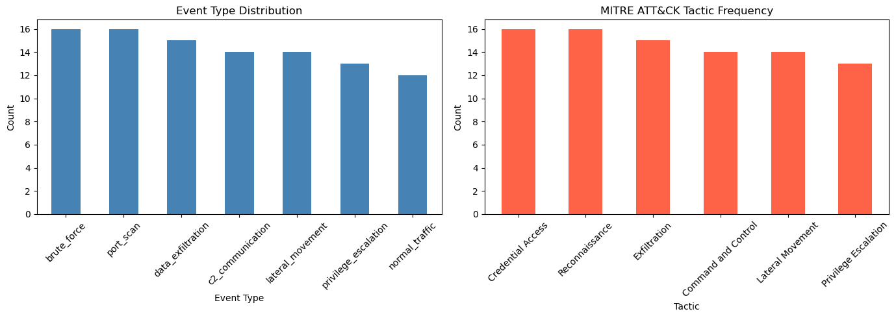

# Lab 5 Report — Event-Driven Cybersecurity Pipeline

---

## Pipeline Run Output

### Producer — 100 events published to `events.raw`

```
[1/100] Sent event: 2e7f9b77-c1e6-4c2e-8c7d-151bcfe60e0b (brute_force)
[2/100] Sent event: 949bd870-f195-4c6d-be29-d3a527ca93fb (normal_traffic)
[3/100] Sent event: 8e88840a-8ff4-4bde-9d7d-93b54ae97103 (privilege_escalation)
[4/100] Sent event: 92f5c0e0-faf2-4fed-b6b9-0dbba3f9445c (privilege_escalation)
[5/100] Sent event: fd358c83-8f88-4a43-80a1-d254e63eced4 (c2_communication)
...
[96/100] Sent event: 777f2679-c7d5-45c0-bbb3-e8d37a7314af (lateral_movement)
[97/100] Sent event: 448a2e44-23d2-417e-8be9-0f8c8df9d68f (data_exfiltration)
[98/100] Sent event: cbbb7ff0-b10d-4a31-9dc5-658a99d4f516 (data_exfiltration)
[99/100] Sent event: 13e2da1a-74a1-418f-a255-72566ee15ffd (privilege_escalation)
[100/100] Sent event: b382f799-2305-4b89-8e7f-eec6e0c37334 (c2_communication)

Done. 100 events published to topic 'events.raw'.
```

### Consumer & Classifier — MITRE ATT&CK classification results

```
Classified: 2e7f9b77-c1e6-4c2e-8c7d-151bcfe60e0b -> Credential Access / T1110
Classified: 949bd870-f195-4c6d-be29-d3a527ca93fb -> N/A / N/A
Classified: 8e88840a-8ff4-4bde-9d7d-93b54ae97103 -> Privilege Escalation / T1068
Classified: 92f5c0e0-faf2-4fed-b6b9-0dbba3f9445c -> Privilege Escalation / T1068
Classified: fd358c83-8f88-4a43-80a1-d254e63eced4 -> Command and Control / T1071
Classified: adff4330-9b03-4260-8394-eb584216bb14 -> Reconnaissance / T1595
Classified: 3773c6db-6112-4937-af50-62f46c9f7e60 -> Privilege Escalation / T1068
Classified: 5155e795-2f2d-4cd0-9379-d803d71b25fd -> Reconnaissance / T1595
Classified: 81907db2-37e6-46eb-8a1a-28382fb6bcf0 -> Exfiltration / T1041
Classified: 75c7c81c-e710-4c91-a0ef-c3ceff34fa4e -> Command and Control / T1071
...
Classified: b188690f-4b10-4ba6-b412-c94959a5527c -> Lateral Movement / T1021
Classified: 777f2679-c7d5-45c0-bbb3-e8d37a7314af -> Lateral Movement / T1021
Classified: 448a2e44-23d2-417e-8be9-0f8c8df9d68f -> Exfiltration / T1041
Classified: cbbb7ff0-b10d-4a31-9dc5-658a99d4f516 -> Exfiltration / T1041
Classified: 13e2da1a-74a1-418f-a255-72566ee15ffd -> Privilege Escalation / T1068
Classified: b382f799-2305-4b89-8e7f-eec6e0c37334 -> Command and Control / T1071

Done. Results saved to /home/jovyan/data/classified_packets.csv.
```

### Statistics — Class distribution and MITRE breakdown

```
Total events: 100

=== Class Distribution ===
event_type
brute_force             16
port_scan               16
data_exfiltration       15
c2_communication        14
lateral_movement        14
privilege_escalation    13
normal_traffic          12

=== MITRE Technique Breakdown ===
        mitre_tactic                       mitre_technique  technique_id  count
 Command and Control            Application Layer Protocol         T1071     14
   Credential Access                           Brute Force         T1110     16
        Exfiltration          Exfiltration Over C2 Channel         T1041     15
    Lateral Movement                       Remote Services         T1021     14
Privilege Escalation Exploitation for Privilege Escalation         T1068     13
      Reconnaissance                       Active Scanning         T1595     16
```



---

## 1. Why is Kafka used instead of direct function calls?

A direct function call is synchronous and tightly coupled: the producer must wait for the consumer to finish before continuing, and if the consumer crashes, the event is lost. Kafka decouples the two sides entirely.

In this pipeline, the Producer publishes events to the `events.raw` topic and moves on immediately without knowing or caring whether the Consumer is running. The Consumer reads at its own pace from a durable, ordered log. This gives three concrete benefits:

- **Durability** — events are persisted on disk inside Kafka. If the Consumer crashes mid-run, it resumes from its last committed offset and processes no event twice.
- **Decoupling** — Producer and Consumer can be developed, deployed, and restarted independently.
- **Buffering** — Kafka absorbs bursts. If the Producer suddenly emits 10,000 events/sec, they queue up and the Consumer drains them at whatever rate it can sustain.

In a real SOC, sensors and log shippers are the producers. They cannot be slowed down or blocked by downstream processing — Kafka acts as the shock absorber between ingest and analysis.

---

## 2. What happens if the consumer is slower than the producer?

Events accumulate in the Kafka topic as **consumer lag** — the difference between the latest offset written by the producer and the last offset committed by the consumer. The producer is never blocked or slowed down; it simply continues appending to the log.

Kafka retains the backlog for a configurable retention period (default 7 days). The consumer will eventually catch up as long as its throughput is sufficient. You can observe this in Redpanda Console under **Consumer Groups → classifier-group**: the lag counter shows exactly how many unprocessed messages are waiting.

If lag grows unboundedly (consumer is permanently slower than producer), the solutions are:
- **Scale out** — run multiple Consumer instances in the same consumer group; Kafka distributes partitions across them in parallel.
- **Increase partitions** — more topic partitions allow more parallel consumers.
- **Optimize the consumer** — in this lab, MITRE classification is a pure dictionary lookup (O(1)), so it is unlikely to be the bottleneck. In a real system, an ML-based classifier could be the slow step and would be the first target for optimization.

---

## 3. How does tracing help debug pipeline behavior?

Each event in this pipeline passes through three stages: consumption, classification, and CSV write. Without tracing, a slowdown or failure anywhere in that chain produces no structured diagnostic signal — you would have to grep logs and manually correlate timestamps.

Jaeger tracing attaches a unique trace ID to every event as it enters the pipeline. Each stage opens a child span, records its start/end time and any attributes (e.g., `event.id`), and closes. The result is a visual timeline for every single event showing:

- **Which stage was slow** — if `storage.write` spans are consistently wide, disk I/O is the bottleneck.
- **Where errors occurred** — a failed span is marked in red, immediately locating the broken stage without log archaeology.
- **End-to-end latency** — the outer `kafka.consume` span captures total processing time per event.
- **Outliers** — sorting traces by duration in Jaeger instantly surfaces the slowest events.

In a real SOC pipeline with dozens of microservices, distributed tracing is the only practical way to follow a single alert across service boundaries and answer "why did this alert take 8 seconds to reach the analyst dashboard?"

---

## 4. Which pipeline stages could be scaled independently?

Because the pipeline is decoupled via Kafka, each stage is an independent scaling unit:

| Stage | How to scale | Kafka mechanism |
|---|---|---|
| **Producer** | Run multiple producer instances (multiple sensors/log shippers) | All write to the same topic; Kafka merges the streams |
| **Consumer / Classifier** | Run multiple consumer instances in the same `classifier-group` | Kafka assigns one partition per consumer instance; they process in parallel |
| **Kafka broker** | Add brokers and increase topic partition count | Partitions distribute load across brokers |
| **Jaeger** | Switch from `all-in-one` to a distributed Jaeger deployment with a separate collector, query, and storage backend | Independent of the pipeline itself |
| **Storage (CSV → database)** | Replace the CSV writer with a database writer; scale the DB separately | Consumer writes to DB; DB scales via replication/sharding |

The classifier is stateless (pure dictionary lookup), making it the easiest stage to scale horizontally — simply launch more Consumer containers in the same consumer group.

---

## 5. How would this pipeline change in a real SOC system?

The lab is a minimal proof-of-concept. A production SOC pipeline would differ in several key areas:

**Data sources** — Instead of a synthetic event generator, real inputs would be SIEM agents, EDR telemetry, firewall logs, and network tap data, all streaming into Kafka over authenticated, TLS-encrypted connections.

**Classification** — The hardcoded MITRE dictionary would be replaced by an ML model (e.g., a fine-tuned classifier or an LLM-based reasoning engine) capable of handling ambiguous, multi-stage attack patterns and novel techniques not yet in the ATT&CK framework.

**Multiple topics** — A real pipeline uses topic-per-severity or topic-per-source to allow different consumer groups to process high-priority alerts faster than low-priority telemetry, and to apply different retention policies.

**Stateful correlation** — Real attacks span many events over time (e.g., reconnaissance → lateral movement → exfiltration). A stateful stream processor (Apache Flink or Kafka Streams) would correlate events across a time window to detect multi-step attack chains — something a stateless per-event classifier cannot do.

**Alert routing** — Classified events would be written back to a Kafka topic (not a local CSV), from which downstream consumers route to a ticketing system (e.g., PagerDuty, JIRA), an analyst dashboard (e.g., Splunk, Elastic SIEM), or an automated response engine (e.g., SOAR platform).

**Reliability and security** — Kafka would run in a multi-broker cluster with replication factor ≥ 3, all inter-service traffic would use mTLS, and consumer offsets would be committed only after successful processing to guarantee at-least-once delivery.
